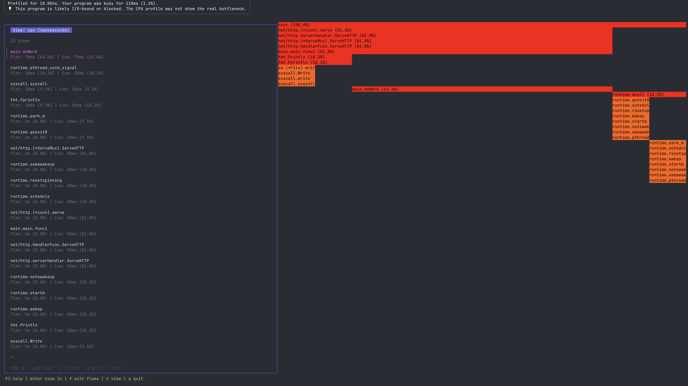

# pproftui: Profiling Without Losing Your Mind

Learning about profiling, and specifically the golang pprof tool for the first time is always exciting. You think
finally i can be that person that can spot performance issues...i can be a 10x developer!

Then you use it...

The drop in excitement for me was quite **discouraging**, because here i am, someone, that wants to get more into performance so i can improve my app or code or just learning really, but somehow, with all the unclear terminologies like `cum`, `flat`, `samples`, and `percentages` besides numbers that all don’t immediately make sense — you spend more time googling these things than even profiling what you have.

Oh and the context switch between the web and back to your code!

Well, it's now in your terminal, with a very useful help button when you hit F1.

## ✨ Core Features

*   **Integrated Source View:** See the exact line of code for any function without leaving the profiler.
*   **Focus On Your Code:** Use the `--module-path` flag to highlight your project's code, and press `p` to filter out all the noise.
*   **Powerful Diffing:** Don't just see *what* changed between two profiles. The delta graph view lets you navigate the call stack to see exactly *why* it changed.
*   **Live Profiling:** Point it at a running Go application's `/debug/pprof` endpoint.
*   **Interactive Flame Graphs:** Toggle to a flame graph view to get a bird's-eye view of your application's hot spots.

---

## 🧾 License

MIT LICENSED.

---

## ⚡ Quick Usage

```sh
git clone https://github.com/Oloruntobi1/pproftui.git
cd pproftui
go build -o pproftui

# Profile a local file
./pproftui cpu.prof

# Focus on your project's code
./pproftui --module-path "github.com/your/project" cpu.prof
```

### Comparing Profiles (Diffing)

To find a performance regression, diff two profiles:

```sh
./pproftui before_cpu.prof after_cpu.prof
```

### Live Profiling

Profile a running application for 10 seconds:
```sh
./pproftui http://localhost:6060/debug/pprof/profile?seconds=10
```
> (If your app is idle, simulate some work while this is running to get a useful profile.)

---

## 🧭 Hotkeys

*   `t` — Toggle between different profile types (e.g., `inuse_space`, `alloc_objects`).
*   `c` — Toggle between source code view and the **callers/callees** graph view.
*   `p` — Toggle the **"Project Only"** filter to hide runtime/vendor code.
*   `s` — Cycle through sort orders (`Self`, `Total`, `Name`).
*   `f` — Toggle the **flame graph** view.
    *   `Enter` / `Backspace` — Zoom in/out on the flame graph.
*   `q` — Quit.
*   **F1** — Show detailed help and explanations.

---

## 📸 Screenshots



Check the `screenshots` folder for more.

---

More profiles will be supported sometime later. Cheers.
